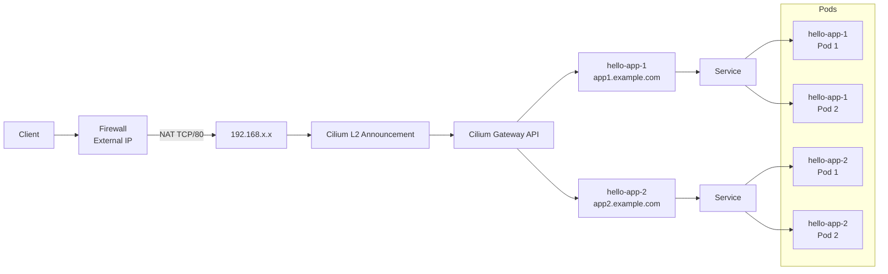

# Cilium Gateway API with LB-IPAM and L2 Announcement

## About Gateway API

Gateway API is a Kubernetes standard for configuring and managing network traffic. It can be used with different Kubernetes networking solutions, including Cilium, Istio, Envoy Gateway, Traefik and others.

See the official list of Gateway API implementations:

https://gateway-api.sigs.k8s.io/docs/implementations/list/


## Overview

This guide builds on the [Cilium LB-IPAM example](Cilium%20LB-IPAM%20example.md) and uses Cilium as the Gateway API implementation, together with LB-IPAM and L2 Announcement.

The LB-IPAM pool and L2 Announcement configuration must already be available. The test application and LoadBalancer Service from the LB-IPAM example are not required.

This guide demonstrates how to expose multiple Kubernetes applications through a single Gateway IP.

**Important:** This guide is specifically written and tested for Cilium. Configuration and supported features may differ between Gateway API implementations.

### Traffic Flow Diagram



---

# Prerequisites

This guide assumes:

- A running Kubernetes cluster
- Cilium installed
- Cilium LB-IPAM enabled
- Cilium L2 Announcement enabled

Before continuing, check which version of Cilium is currently running in the cluster. The Gateway API configuration and required CRDs should be compatible with the installed Cilium version.

Run:
```bash
kubectl -n kube-system get pods -l k8s-app=cilium \
  -o jsonpath='{.items[0].spec.containers[0].image}{"\n"}'
```

Example output:
```
registry-proxy.previder.io/quay/cilium/cilium:v1.19.4@sha256:2eb67991eaa9368ba199c2fac2c573cb0ffdeb79184533344f42fc9a7ff6af3c
```

At the time of writing, this guide is based on Cilium v1.19.4

**Important:** Always check the Cilium version before proceeding. Use the documentation that corresponds to the installed Cilium version.

For Cilium v1.19, see the official Cilium Gateway API documentation:

https://docs.cilium.io/en/v1.19/network/servicemesh/gateway-api/gateway-api/

---

# 1. Install Gateway API CRDs

Gateway API resources are not installed by default in Kubernetes.

For Cilium v1.19, the following Gateway API v1.4.1 CRDs are required:

- GatewayClass
- Gateway
- HTTPRoute
- ReferenceGrant
- GRPCRoute

```bash
kubectl apply -f https://raw.githubusercontent.com/kubernetes-sigs/gateway-api/v1.4.1/config/crd/standard/gateway.networking.k8s.io_gatewayclasses.yaml
kubectl apply -f https://raw.githubusercontent.com/kubernetes-sigs/gateway-api/v1.4.1/config/crd/standard/gateway.networking.k8s.io_gateways.yaml
kubectl apply -f https://raw.githubusercontent.com/kubernetes-sigs/gateway-api/v1.4.1/config/crd/standard/gateway.networking.k8s.io_httproutes.yaml
kubectl apply -f https://raw.githubusercontent.com/kubernetes-sigs/gateway-api/v1.4.1/config/crd/standard/gateway.networking.k8s.io_referencegrants.yaml
kubectl apply -f https://raw.githubusercontent.com/kubernetes-sigs/gateway-api/v1.4.1/config/crd/standard/gateway.networking.k8s.io_grpcroutes.yaml
```
**Note:** If TLS passthrough using TLSRoute is required, install the additional TLSRoute CRD from the experimental Gateway API resources.

```bash
kubectl apply -f https://raw.githubusercontent.com/kubernetes-sigs/gateway-api/v1.4.1/config/crd/experimental/gateway.networking.k8s.io_tlsroutes.yaml
```


Verify the Gateway API resources

```bash
kubectl api-resources | grep gateway
```

Expected:

```
gateways gateway.networking.k8s.io
httproutes gateway.networking.k8s.io
referencegrants gateway.networking.k8s.io
grpcroutes gateway.networking.k8s.io
```
If TLSRoute was installed, it should also appear in the output:

```
tlsroutes gateway.networking.k8s.io
```

---

# 2. Verify Cilium Gateway API

Check your Cilium configuration:

```bash
kubectl -n kube-system get configmap cilium-config -o yaml | grep enable-gateway-api
```

The expected output is:

```yaml
enable-gateway-api: "true"
```

If the output shows:

```yaml
enable-gateway-api: "false"
```
or the setting is not present, Gateway API is not enabled. Do not continue until this has been resolved.

---

# 3. Create GatewayClass

The GatewayClass tells Kubernetes which controller manages the Gateway.

Create:

`gateway-class.yaml`

```yaml
apiVersion: gateway.networking.k8s.io/v1
kind: GatewayClass
metadata:
  name: cilium
spec:
  controllerName:
    io.cilium/gateway-controller
```

Apply:

```bash
kubectl apply -f gateway-class.yaml
```

Verify:

```bash
kubectl get gatewayclass
```

Expected output:

```
NAME     CONTROLLER                     ACCEPTED   AGE
cilium   io.cilium/gateway-controller   True       ...
```

If the ACCEPTED status remains Unknown, first verify that all required Gateway API CRDs are installed and that the Cilium Operator is running. If the CRDs were installed after the Cilium Operator started, restart the Cilium Operator:

```bash
kubectl -n kube-system rollout restart deployment/cilium-operator
```

Wait for the rollout to complete:

```bash
kubectl -n kube-system rollout status deployment/cilium-operator
```

Then check the GatewayClass again:

```bash
kubectl get gatewayclass
```

# 4. Create Gateway

The Gateway is the external entry point.

Cilium will create a LoadBalancer Service for the Gateway. The IP address is automatically assigned from the existing Cilium LB-IPAM pool.

The existing L2 Announcement policy selects LoadBalancer Services using the `advertise=true` label. We therefore pass this label to the generated Gateway Service using `spec.infrastructure.labels`.

Because kube-vip is also running in the cluster, the generated LoadBalancer Service must be marked with `kube-vip.io/ignore: "true"` so that kube-vip does not manage the VIP.

Create:

`gateway.yaml`

```yaml
apiVersion: gateway.networking.k8s.io/v1
kind: Gateway
metadata:
  name: demo-gateway
spec:
  gatewayClassName: cilium
  infrastructure:
    labels:
      advertise: "true"
    annotations:
      kube-vip.io/ignore: "true"
  listeners:
  - name: http
    protocol: HTTP
    port: 80
```

Apply:

```bash
kubectl apply -f gateway.yaml
```

Check:

```bash
kubectl get gateway
```

Example:

```
NAME            ADDRESS          PROGRAMMED    AGE
demo-gateway    192.168.1.240    True          ...
```
The Gateway must have an assigned IP address and the PROGRAMMED status must be True before continuing.

---

# 5. Deploy example applications

We will deploy two applications:

- hello-app-1
- hello-app-2

Each application has its own Service.

The applications in this section are only used to demonstrate HTTP routing and can be replaced by your own applications and Services.

---

## Application 1

Create:

`hello-app-1-deployment.yaml`

```yaml
apiVersion: apps/v1
kind: Deployment
metadata:
  name: hello-app-1
spec:
  replicas: 2
  selector:
    matchLabels:
      app: hello-app-1
  template:
    metadata:
      labels:
        app: hello-app-1
    spec:
      containers:
      - name: hello-kubernetes
        image: paulbouwer/hello-kubernetes:1.10
        env:
        - name: MESSAGE
          value: "Hello from application 1"
```

`hello-app-1-service.yaml`

```yaml
---
apiVersion: v1
kind: Service
metadata:
  name: hello-app-1
spec:
  selector:
    app: hello-app-1
  ports:
  - port: 80
    targetPort: 8080
```

Apply:

```bash
kubectl apply -f hello-app-1-deployment.yaml
kubectl apply -f hello-app-1-service.yaml
```
---

## Application 2

Create:

`hello-app-2-deployment.yaml`

```yaml
apiVersion: apps/v1
kind: Deployment
metadata:
  name: hello-app-2
spec:
  replicas: 2
  selector:
    matchLabels:
      app: hello-app-2
  template:
    metadata:
      labels:
        app: hello-app-2
    spec:
      containers:
      - name: hello-kubernetes
        image: paulbouwer/hello-kubernetes:1.10
        env:
        - name: MESSAGE
          value: "Hello from application 2"
```
`hello-app-2-service.yaml`

```yaml
---
apiVersion: v1
kind: Service
metadata:
  name: hello-app-2
spec:
  selector:
    app: hello-app-2
  ports:
  - port: 80
    targetPort: 8080
```

Apply:

```bash
kubectl apply -f hello-app-2-deployment.yaml
kubectl apply -f hello-app-2-service.yaml
```

---

# 6. Create HTTPRoutes

Now we connect HTTP traffic to the correct application. Replace the hostnames with the hostnames you intend to use for the application.

---

## Route application 1

Create:

`route-app-1.yaml`

```yaml
apiVersion: gateway.networking.k8s.io/v1
kind: HTTPRoute
metadata:
  name: hello-app-1-route
spec:
  parentRefs:
  - name: demo-gateway
  hostnames:
  - "app1.example.com"
  rules:
  - backendRefs:
    - name: hello-app-1
      port: 80
```

Apply:

```bash
kubectl apply -f route-app-1.yaml
```

---

## Route application 2

Create:

`route-app-2.yaml`

```yaml
apiVersion: gateway.networking.k8s.io/v1
kind: HTTPRoute
metadata:
  name: hello-app-2-route
spec:
  parentRefs:
  - name: demo-gateway
  hostnames:
  - "app2.example.com"
  rules:
  - backendRefs:
    - name: hello-app-2
      port: 80
```

Apply:

```bash
kubectl apply -f route-app-2.yaml
```

---

# 7. Configure DNS and Test HTTPRoutes

Before testing the applications, make sure the hostnames configured in the HTTPRoute resources resolve to the external IP address of the Kubernetes cluster.

If you are using a registered domain, configure the DNS records for the hostnames to point to the external IP address of the cluster.

Make sure the required NAT rules are configured to forward the incoming traffic to the Kubernetes cluster.

**Important:** The hostname used to access the application must match the hostname configured in the corresponding HTTPRoute.

## Verify the HTTPRoutes

Check the status of the HTTPRoutes:

```bash
kubectl get httproute
```

Expected output:

```
NAME                HOSTNAMES              AGE
hello-app-1-route   ["app1.example.com"]   ...
hello-app-2-route   ["app2.example.com"]   ...
```

## Test the applications

Test both applications using their configured hostnames:

```
curl http://app1.example.com
curl http://app2.example.com
```

Each request should be routed through the Cilium Gateway to the corresponding application.
