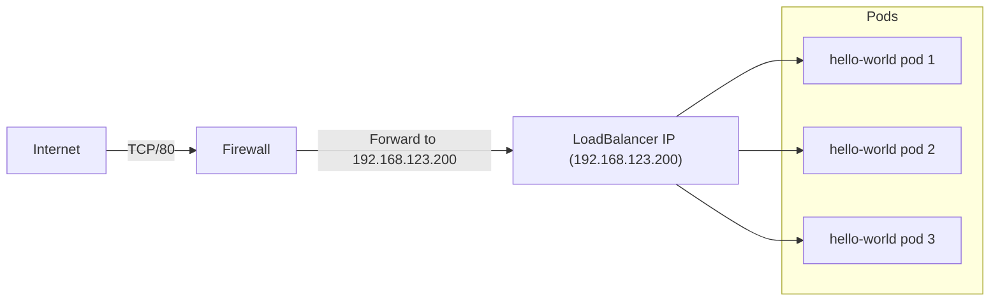

# Internal Load Balancer setup with L2Advertisement and a Firewall

In this example, we will set up a L2 advertisement with Cilium LB-IPAM connectend to a firewall for outside access.

When using Cilium LB-IPAM in combination with a firewall, Cilium assigns external IPs from a predefined pool to Kubernetes LoadBalancer services. The cluster nodes then announce those IPs on the local network (via ARP/NDP), making them reachable as if they were real hosts. The firewall can simply forward traffic from the public IP to the Cilium-assigned service IP, removing the need for per-node NodePort rules and providing a clean load balancer.

## Exposing Services with Cilium LB-IPAM and a Firewall

When using **Cilium LB-IPAM** in combination with a **firewall**, Cilium assigns external IPs from a predefined pool to Kubernetes `LoadBalancer` services. The cluster nodes then announce those IPs on the local network (via ARP/NDP), making them reachable as if they were real hosts. pfSense can simply forward traffic from the public IP to the Cilium-assigned service IP, removing the need for per-node NodePort rules and providing load balancing.


### Traffic Flow Diagram



## Cluster and firewall setup
If the installation has not yet been done, install the cluster and firewall according to the following manual: [Installatiehandleiding](https://github.com/previder/kubernetes-examples/tree/main/docs)

---
## 1. Enable Cilium L2 Announcements

First, make sure that **Cilium L2Announcements** is supported from the configuration files.  
By default, this feature is **not enabled**. You can enable it by patching the ConfigMap as follows:
```bash
kubectl -n kube-system patch configmap cilium-config \
  --type merge \
  -p '{"data":{"enable-l2-announcements":"true"}}'
```

Then restart Cilium to activate the change:
```bash
kubectl -n kube-system rollout restart ds/cilium
```

Finally, verify that the EnableL2Announcements variable is set to "true":
```bash
kubectl -n kube-system exec ds/cilium -- cilium-dbg config --all | grep EnableL2Announcements
```

## 2. LoadBalancer IP Pool (CiliumLoadBalancerIPPool)

Define the IP range that Cilium can use for assigning LoadBalancer services. This must be in the same range that de firewall DHCP server uses, but the adresses cannot be part of the DHCP pool that is configured.

```yaml
apiVersion: cilium.io/v2alpha1
kind: CiliumLoadBalancerIPPool
metadata:
  name: public-pool
spec:
  blocks:
  - start: "192.168.123.200"
    stop: "192.168.123.210"
```

👉 Defines an IP range that Cilium can use for assigning LoadBalancer services.

---

## 3. L2 Announcement Policy

```yaml
apiVersion: cilium.io/v2alpha1
kind: CiliumL2AnnouncementPolicy
metadata:
  name: announce-all
spec:
  loadBalancerIPs: true
  externalIPs: true
  serviceSelector:
    matchLabels:
       advertise: "true"
   nodeSelector:
     matchExpressions:
       - key: node-role.kubernetes.io/control-plane
         operator: DoesNotExist

```

👉 Ensures cluster nodes respond to ARP/NDP requests for assigned LoadBalancer IPs, so pfSense and your network can reach them.

---

## 4. Hello Kubernetes Deployment
For testing deploy a simple Hello Kubernetes deployment based on Paul Bouwer's  ([test deployment](https://github.com/paulbouwer/hello-kubernetes))

```yaml
apiVersion: apps/v1
kind: Deployment
metadata:
  name: hello-kubernetes
spec:
  replicas: 3
  selector:
    matchLabels:
      app: hello-kubernetes
  template:
    metadata:
      labels:
        app: hello-kubernetes
    spec:
      containers:
      - name: hello-kubernetes
        image: paulbouwer/hello-kubernetes:1.8
        ports:
        - containerPort: 8080
        env:
        - name: MESSAGE
          value: Kubernetes bij Previder!!

```

👉 Runs a simple HTTP echo server on port `8080`.

---

## 5. Hello Kubernetes Service (LoadBalancer)

```yaml
apiVersion: v1
kind: Service
metadata:
  name: hello-kubernetes
spec:
  type: LoadBalancer
  ports:
  - port: 80
    targetPort: 8080
  selector:
    app: hello-kubernetes

```

👉 This LoadBalancer service automatically gets an external IP from the pool (`192.168.123.200-210`).

---

## 🚀 Deploy Everything

```bash
kubectl apply -f cilium-ippool.yaml
kubectl apply -f cilium-l2policy.yaml
kubectl apply -f hello-kubernetes-deployment.yaml
kubectl apply -f hello-kubernetes-service.yaml
```

---

## 🔍 Verify

```bash
kubectl get svc hello-kubernetes
```

Expected output:

```
NAME               TYPE           CLUSTER-IP      EXTERNAL-IP      PORT(S)        AGE
hello-kubernetes   LoadBalancer   10.96.45.123    192.168.123.200   80:31234/TCP   10s
```

- **EXTERNAL-IP** should come from your pool (e.g., `192.168.123.200`).  
- Accessible directly on your LAN via `http://192.168.123.200`.  
- In the firewall, configure a NAT/port forward from your public IP to `192.168.123.200:80`.

---

## ✅ Summary

- Each new LoadBalancer service gets an IP from the pool automatically.  
- No more manual NodePort + NAT configuration in pfSense.  
- Provides a true LoadBalancer experience on a Vanilla Kubernetes Deployment.  


